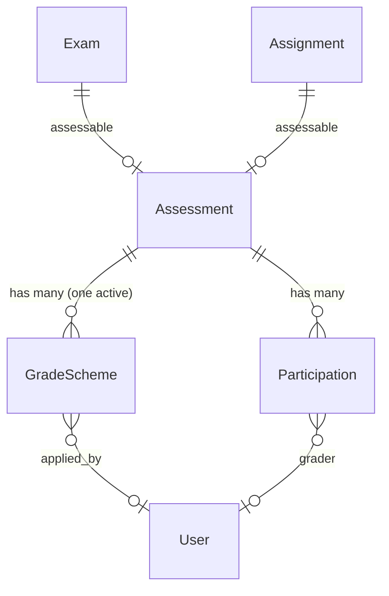
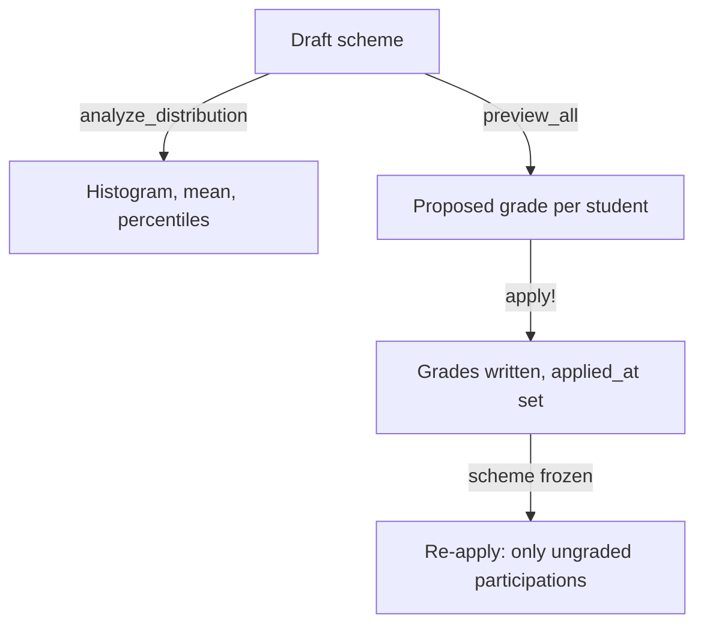

# Slice 5 — Exam Gradability

```admonish info "What this page is"
An orientation map for the fifth Müsli slice (PR #1111, branch
`muesli-05-exam-grading`).
```

## TL;DR

Slice 5 turns raw points into **grades**.

1. A **grade scheme** describes how points map to grades — a list of bands, each
   with a threshold and a grade.
2. An **applier** analyses the point distribution, previews what a scheme would
   do, and writes the grades.
3. **Absence handling** gives absent and exempt participations a defined outcome.
4. Once a scheme has been applied it is **frozen**, so the mapping that produced
   existing grades cannot be edited underneath them.

This closes the chain: slice 1 collected points, slice 2 aggregated them,
slice 3 decided who may sit, slice 4 ran the exam — slice 5 grades it.

## New models

| Model | Purpose | Notable columns |
|---|---|---|
| [`Assessment::GradeScheme`](../features/05b-grading-schemes.md#assessmentgradescheme-activerecord-model) | Points-to-grade mapping for one assessment | `kind` (`banded`), `config` (jsonb), `version_hash`, `active`, `applied_at`, `applied_by_id`, `points_step` |
| [`Assessment::GradeSchemeApplier`](../features/05b-grading-schemes.md#assessmentgradeschemeapplier-service-object) | Analyse, preview and apply a scheme | *(no table)* |
| [`Assessment::AbsenceHandling`](../features/04-assessments-and-grading.md#absence-tracking--no-shows) | Transitions to absent/exempt | *(concern)* |

## The band config

A scheme's `config` holds bands in one of two shapes — absolute or percentage,
never mixed:

```json
{ "bands": [ { "min_points": 54, "grade": "1.0" },
             { "min_points": 48, "grade": "1.3" },
             { "min_points": 0,  "grade": "5.0" } ] }
```

```json
{ "bands": [ { "min_pct": 90, "grade": "1.0" },
             { "min_pct": 0,  "grade": "5.0" } ] }
```

`GradeScheme.two_point_auto` generates the absolute shape from an *excellence*
and a *passing* point value, spreading the ten passing grades evenly and
rounding to `points_step`.

## How it relates



```admonish note "A scheme belongs to an assessment, not to a lecture or an exam"
Because `Assessment` is polymorphic, the same machinery grades an exam and an
assignment. Nothing is exam-specific — the exam only appears as the assessable.
```

~~~admonish note "Percentage bands divide by `effective_total_points`"
That is slice 1's value: the sum of the tasks' `max_points`, with no column to
override it — see
[Tasks are the only source](01-assessment-core.md#tasks-are-the-only-source-of-what-an-assessment-is-worth).
Adding or removing a task therefore shifts every percentage-based grade.

Results above 100 % are normal, because task points are not capped at the task
maximum. `apply_percentage_scheme` sorts bands descending and matches with `>=`,
so such a result lands in the top band rather than falling through.
~~~

## Applying a scheme



The second run is the interesting one: after `applied_at` is set, `apply!`
narrows its target to participations that have **no** grade yet, so grades
entered or corrected by hand are not overwritten. See
[Behavior Highlights](../features/05b-grading-schemes.md#behavior-highlights).

~~~admonish danger "Concerns another PR: what `muesli/tutor-grading-view` has to honour"
Nothing in slices 1–5 writes a grading state. No controller enters task points,
none sets `reviewed`, none marks a participant absent or exempt —
`Gradable#set_grade!` exists but has no caller. Everything that puts a
participation into one of those states is being built on the tutor grading
branch, for exams as well as for seminar talks.

Two rules the model layer here already assumes, and which that branch has to keep:

**"Grading complete" needs points, on a points-based assessment.** If a
participation reaches `reviewed` with no task points at all, applying a scheme
writes it a 5.0 — `compute_grade_for` sees a nil total and falls back. It cannot
tell a premature click apart from a seminar talk, which legitimately has no
points at all. So the action that sets the status has to refuse the empty case;
the fallback is a guard, not a feature. See
[what `reviewed` requires](../features/04-assessments-and-grading.md#status-workflow).

**Excusing someone goes through `AbsenceHandling`, not through a status write.**
`mark_exempt` clears `grade_numeric`, `grader` and `graded_at`, which is what
takes back the 5.0 a no-show was given. Setting `status: :exempt` directly would
leave the failing grade in place, and re-applying the scheme would not remove it
either — exempt participations are never targeted.

The model layer for absences is finished and specced; only the caller is missing:

| Piece | State |
|---|---|
| `mark_absent(participation)` | done — sets `absent`, nulls `submitted_at` |
| `mark_exempt(participation, note:)` | done — plus the note, and clears the grade |
| Reviewed-transition guard | done — raises `InvalidTransitionError` |
| `note` column for the certificate reference | migrated, unused |
| `absent` / `exempt` enum values | done |
| Model specs | `absence_handling_spec`, 10 examples |
~~~

## Before you read the code

Five places in this diff that look like working features but are groundwork. The
rules behind them live in [Grading Schemes](../features/05b-grading-schemes.md)
and [Assessments & Grading](../features/04-assessments-and-grading.md); this page
says what you need in order to read *this branch*.

### `two_point_auto` is never called

The Ruby generator carries the algorithm, all five input guards and thirteen
specs — and no caller. The bands a teacher actually gets are built in the
browser by `computeBands`, which has no tests, and the input guards sit in a
third file, `scheme_form.controller.js`. The two implementations agree today;
nothing keeps them in step. See
[the generator exists twice](../features/05b-grading-schemes.md#interactive-curve-generation-frontend-convenience).

### Percentage bands can be read but not created

`apply_percentage_scheme`, the validation and the summary all handle `min_pct`
bands, and specs cover them. Nothing in the application writes one — there is no
generator, and the form only offers points. A percentage scheme can therefore
only arrive through a seed or the console.

Note also that a band is a **lower bound only**. A `max_points` or `max_pct` key
is ignored; the highest band a student reaches wins.

### `version_hash` is written and never read

It is recomputed on every config change and stored, but no code compares it. The
idempotency of a second `apply!` comes from `applied_at`. Treat the column as
prepared, not load-bearing.

### The 5.0 fallbacks guard states that cannot arise here

`compute_grade_for` returns 5.0 when `points_total` is nil, and again when a
percentage scheme finds no maximum. Both are backstops: the first would mean a
participation marked `reviewed` with nothing entered, which the action that sets
the status has to refuse — and that action is not in this stack. Reading them as
grading rules would be a mistake.

### The absent branch of the applier is unreachable

`apply!` grades `absent` participations 5.0 and skips `exempt` ones, and that is
the right rule — see
[`absent` and `exempt` are opposites](../features/04-assessments-and-grading.md#status-workflow).
But nothing can set either status yet, so `absent_participations` is always
empty. The box above says what the branch that wires it has to honour.

## New screens

| Screen | What it does |
|---|---|
| `assessment/assessments/components/scheme_form_component` | Build a scheme: bands, thresholds, live preview |
| `assessment/assessments/components/grade_scheme_summary_component` | Read-only summary of the active scheme |
| `assessment/assessments` (distribution, preview partials) | Point histogram and the effect of a scheme |
| `exams/components` | Grading tab on the exam |
| `roster` | Grade columns in the roster view |

Two Stimulus controllers: `scheme_form` (drives the builder and the preview) and
the preview renderer it delegates to.

## New controller

`Assessment::GradeSchemesController` — create, edit, preview, apply, destroy.

## Migrations

| Migration | Effect |
|---|---|
| `…000003_create_grade_schemes` | table with jsonb config, a partial unique index on one active scheme per assessment |
| `…000004_add_points_step_to_grade_schemes` | `decimal(10,2)`, default 1.0 |

## Suggested reading order (~25 min)

1. `app/models/assessment/grade_scheme.rb` — the config contract and the
   immutability rule
2. `app/models/assessment/grade_scheme_applier.rb` — `compute_grade_for` first,
   then `apply!`
3. `app/models/assessment/absence_handling.rb` — short, but it defines what
   "absent" means for a grade
4. `app/controllers/assessment/grade_schemes_controller.rb`

---

Previous: [Slice 4 — Exam Core & Registrations](04-exam-core.md)
