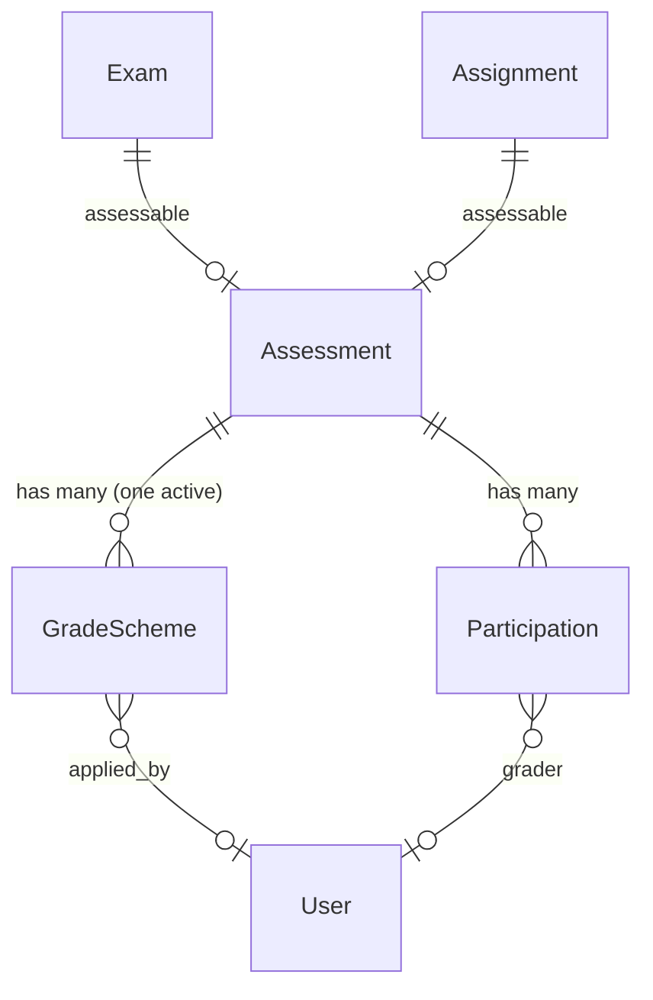
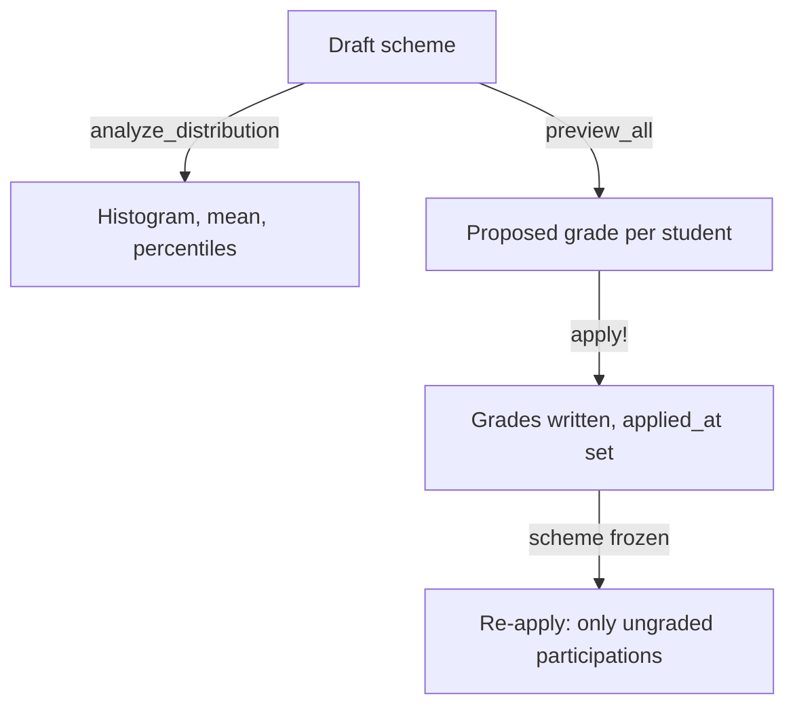

# Slice 5 — Exam Gradability

```admonish info "What this page is"
An orientation map for the fifth Müsli slice (PR #1111, branch
`muesli-05-exam-grading`). The judgement calls are collected in
[Slice 5 — Decisions](05-exam-grading-decisions.md).
```

## TL;DR

Slice 5 turns raw points into **grades**.

1. A **grade scheme** describes how points map to grades — a list of bands, each
   with a threshold and a grade.
2. An **applier** analyses the point distribution, previews what a scheme would
   do, and writes the grades.
3. **Absence handling** gives absent and exempt participations a defined outcome.
4. Once a scheme has been applied it is **frozen**, so the mapping that produced
   existing grades cannot be edited underneath them.

This closes the chain: slice 1 collected points, slice 2 aggregated them,
slice 3 decided who may sit, slice 4 ran the exam — slice 5 grades it.

## New models

| Model | Purpose | Notable columns |
|---|---|---|
| [`Assessment::GradeScheme`](../features/05b-grading-schemes.md#assessmentgradescheme-activerecord-model) | Points-to-grade mapping for one assessment | `kind` (`banded`), `config` (jsonb), `version_hash`, `active`, `applied_at`, `applied_by_id`, `points_step` |
| [`Assessment::GradeSchemeApplier`](../features/05b-grading-schemes.md#assessmentgradeschemeapplier-service-object) | Analyse, preview and apply a scheme | *(no table)* |
| [`Assessment::AbsenceHandling`](../features/04-assessments-and-grading.md#absence-tracking--no-shows) | Transitions to absent/exempt | *(concern)* |

## The band config

A scheme's `config` holds bands in one of two shapes — absolute or percentage,
never mixed:

```json
{ "bands": [ { "min_points": 54, "grade": "1.0" },
             { "min_points": 48, "grade": "1.3" },
             { "min_points": 0,  "grade": "5.0" } ] }
```

```json
{ "bands": [ { "min_pct": 90, "max_pct": 100, "grade": "1.0" },
             { "min_pct": 0,  "max_pct": 39.99, "grade": "5.0" } ] }
```

`GradeScheme.two_point_auto` generates the absolute shape from an *excellence*
and a *passing* point value, spreading the ten passing grades evenly and
rounding to `points_step`.

## How it relates



```admonish note "A scheme belongs to an assessment, not to a lecture or an exam"
Because `Assessment` is polymorphic, the same machinery grades an exam and an
assignment. Nothing is exam-specific — the exam only appears as the assessable.
```

~~~admonish note "Percentage bands divide by `effective_total_points`"
That is slice 1's value: the sum of the tasks' `max_points`, with no column to
override it — see
[Tasks are the only source](01-assessment-core.md#tasks-are-the-only-source-of-what-an-assessment-is-worth).
Adding or removing a task therefore shifts every percentage-based grade.

Results above 100 % are normal, because task points are not capped at the task
maximum. `apply_percentage_scheme` sorts bands descending and matches with `>=`,
so such a result lands in the top band rather than falling through.
~~~

## Applying a scheme



The second run is the interesting one: after `applied_at` is set, `apply!`
narrows its target to participations that have **no** grade yet, so grades
entered or corrected by hand are not overwritten. See
[Behavior Highlights](../features/05b-grading-schemes.md#behavior-highlights).

## New screens

| Screen | What it does |
|---|---|
| `assessment/assessments/components/scheme_form_component` | Build a scheme: bands, thresholds, live preview |
| `assessment/assessments/components/grade_scheme_summary_component` | Read-only summary of the active scheme |
| `assessment/assessments` (distribution, preview partials) | Point histogram and the effect of a scheme |
| `exams/components` | Grading tab on the exam |
| `roster` | Grade columns in the roster view |

Two Stimulus controllers: `scheme_form` (drives the builder and the preview) and
the preview renderer it delegates to.

## New controller

`Assessment::GradeSchemesController` — create, edit, preview, apply, destroy.

## Migrations

| Migration | Effect |
|---|---|
| `…000003_create_grade_schemes` | table with jsonb config, a partial unique index on one active scheme per assessment |
| `…000004_add_points_step_to_grade_schemes` | `decimal(10,2)`, default 1.0 |

## Suggested reading order (~25 min)

1. `app/models/assessment/grade_scheme.rb` — the config contract and the
   immutability rule
2. `app/models/assessment/grade_scheme_applier.rb` — `compute_grade_for` first,
   then `apply!`
3. `app/models/assessment/absence_handling.rb` — short, but it defines what
   "absent" means for a grade
4. `app/controllers/assessment/grade_schemes_controller.rb`
5. [Slice 5 — Decisions](05-exam-grading-decisions.md)

---

Previous: [Slice 4 — Exam Core & Registrations](04-exam-core.md)
